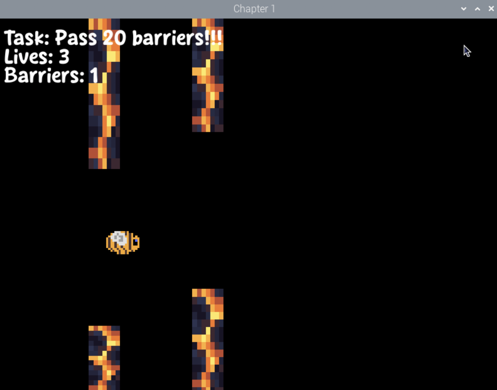
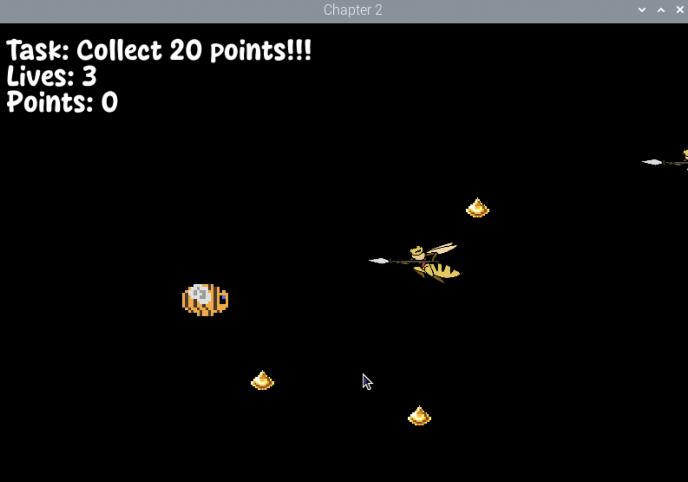

### Hardware Overview

In this project, several hardware components are integrated to create an interactive game experience, using the MPU6050 sensor, Raspberry Pi GPIO pins, and various peripherals such as buttons, LEDs, and a buzzer.

#### **MPU6050 Sensor**
The MPU6050 sensor plays a crucial role in controlling the player’s movement within the game. It is a motion-tracking device equipped with both an accelerometer and a gyroscope. In this project, the accelerometer data from the MPU6050 sensor is used to control the movement of the player character on the screen.

- **Accelerometer**: Measures the acceleration along the x, y, and z axes. In this game, the x and y axis data are used to detect the tilt or movement of the Raspberry Pi, which translates to moving the player’s character in the game. The player’s position on the screen is updated based on the accelerometer’s readings, making the game interactive by responding to the physical movement of the device.
- **Data Handling**: The sensor’s data is read using the I2C interface, and the acceleration values are used to adjust the player’s coordinates in the Pygame environment. By processing the accelerometer data, the player's movements become smooth and responsive to the physical tilting or motion of the device.

#### **GPIO Integration**
The Raspberry Pi's GPIO pins are used to interface with various hardware components that provide physical feedback and allow user interaction with the game. These include buttons for user input, LEDs for visual feedback, and a buzzer for auditory feedback.

- **Button 1 (Pause)**: A button is connected to GPIO pin 17 (BUTTON_1_PIN) and is used to pause the game. When the button is pressed, it triggers the `pause_game()` function, which pauses or unpauses the game. This allows the player to stop the game temporarily, providing a mechanism for user control.
- **Button 2 (Shoot)**: Another button is connected to GPIO pin 27 (BUTTON_2_PIN) and is used for shooting. When this button is pressed, the game triggers the `shoot_bullet()` function, adding a bullet to the game and activating the buzzer and LED as a form of feedback. This button is crucial for the game's shooting mechanic.
  
- **Buzzer**: The buzzer is connected to GPIO pin 24 (BUZZER_PIN) and provides auditory feedback when certain actions occur in the game. Specifically, the buzzer is activated when the player shoots a bullet, creating a sound effect to indicate the action. The buzzer's state is controlled through GPIO output signals, and it is briefly activated when the shooting button is pressed.

- **LEDs**: Two LEDs are used to provide visual feedback. They are connected to GPIO pins 22 and 23 (LED_PIN1 and LED_PIN2).
  - **LED 1**: This LED is used to indicate when the player loses a life. If the player collides with an enemy, LED 1 turns on briefly to signify the life loss, then turns off after a short delay.
  - **LED 2**: This LED provides feedback when the player presses the shoot button. It turns on when the player shoots a bullet, offering visual confirmation of the action.

#### **GPIO Pin Assignment**
Here is a summary of the GPIO pins used for various components in the project:
- **BUTTON_1_PIN (GPIO 17)**: Pause button input
- **BUTTON_2_PIN (GPIO 27)**: Shoot button input
- **BUZZER_PIN (GPIO 24)**: Buzzer output for sound feedback
- **LED_PIN1 (GPIO 22)**: LED 1 for life loss indication
- **LED_PIN2 (GPIO 23)**: LED 2 for shooting feedback

These GPIO pins work together to create a fully interactive game where physical actions (button presses and device movement) are reflected in the game environment with both visual and auditory feedback. The integration of GPIO with the game logic enhances the player's immersive experience by making the game respond to real-world actions.

### Software Components

The software in this project is designed to integrate multiple hardware components, game mechanics, and the game logic in a smooth and interactive way. The following sections explain the key software components involved in the project:

#### **Pygame Setup**
Pygame is used to create the graphical user interface and handle various game elements such as visuals, events, and user inputs. Here's how it's utilized:

- **Screen Setup**: The Pygame library initializes the game window with a resolution of 800x600 pixels. This is done using the `pygame.display.set_mode()` function, which sets up the main screen where the player will interact with the game.
  
- **Images and Graphics**: Pygame handles the loading and scaling of images for various game elements. Images for the player, enemies, food items, and health items are loaded from the file system using `pygame.image.load()`. The images are then scaled to fit the game window dimensions using `pygame.transform.scale()`. These images are displayed on the screen using `blit()`, which draws the image at a specified location.

- **Fonts**: Pygame is also used to render text on the screen. The font is loaded using `pygame.font.Font()`, and the `render()` function is used to draw text on the screen (e.g., score, lives, task messages). The text is rendered in white for visibility and displayed in the top-left corner of the screen.

- **Event Handling**: Pygame handles events such as player input and window closure using `pygame.event.get()`. For example, button presses and other inputs are monitored to trigger game actions (like shooting or pausing). The main event loop constantly checks for these events and updates the game state accordingly.

#### **Sensor Data Processing**
The accelerometer data from the MPU6050 sensor is processed to control the player’s movement on the screen. The data is fetched using the I2C interface from the sensor, and the accelerometer provides values for the x, y, and z axes:

- **Movement Mapping**: The x and y acceleration values from the accelerometer are mapped to the player’s position on the screen. Specifically, the player’s x and y coordinates are adjusted based on the accelerometer readings. For instance, tilting the device along the x-axis will move the player character horizontally on the screen, while tilting along the y-axis will move the player vertically. This creates an intuitive control system where the player moves by physically tilting the device in different directions.

- **Data Processing**: The accelerometer data is read from the sensor in real-time and processed to provide smooth and responsive movement. The data is scaled by a factor (e.g., `int(accel_data['y'] * 2)`) to control the speed of movement on the screen, ensuring the movement is neither too slow nor too fast.

#### **Game Mechanics**
The game mechanics define how the game world behaves and interacts with the player. This section explains the key game mechanics:

- **Player Movement**: The player’s movement is controlled by the accelerometer data. The accelerometer values from the x and y axes are mapped to the player’s screen coordinates, updating the player's position on the screen continuously. The movement is constrained to the screen boundaries to ensure the player doesn't move off-screen.

- **Shooting**: Shooting is handled through a button press (GPIO 27) connected to the Raspberry Pi. When the player presses the shoot button, a new bullet is created, and the `shoot_bullet()` function is invoked. This function also activates a buzzer and LED to provide feedback to the player, signaling that the shoot action was successful. The bullets move across the screen, and collision detection is used to check if they hit enemies, food items, or health items.

- **Game Logic**:
  - **Enemies**: Enemies are spawned periodically at random positions on the screen. They move toward the player, and if they collide with the player, the player loses a life. When an enemy is hit by a bullet, it is removed from the game, and the player earns points.
  - **Food Items**: Food items are also spawned randomly and provide the player with points when collected. These items are drawn on the screen and disappear when the player’s character collides with them.
  - **Health Items**: Health items work similarly to food items but provide the player with an extra life when collected. The player can collect health items to increase their lives, but the maximum number of lives is capped to three.
  - **Boss Mechanics**: The boss enemy is introduced when the player’s score reaches 10. The boss has higher health and periodically shoots bullets at the player. The player must shoot the boss with their bullets to reduce its health, and if the boss’s health reaches zero, the player wins the game.

#### **Pause Button**
The game can be paused at any time by pressing the pause button (connected to a GPIO pin). This button is also monitored through a separate thread, ensuring the pause action can occur independently of the game loop.
Pause Behavior: When the pause button is pressed, the game enters a paused state where the game logic halts temporarily. The screen shows a “Game Paused” message, and all movement, shooting, and enemy actions are suspended.
Resuming the Game: The game can be resumed by pressing the pause button again, returning the game to its normal state. This allows the player to take a break without exiting the game.

#### **Multithreading**
Multithreading is used to handle multiple tasks concurrently, allowing the game to be more responsive and interactive. The primary use of multithreading in this project is for the shooting mechanism:

- **Shooting Thread**: A separate thread is created to continuously monitor the state of the shoot button (GPIO 27). The thread checks whether the button is pressed and calls the `shoot_bullet()` function whenever a press is detected. This ensures that the shooting action can be handled independently of the main game loop, preventing delays or unresponsiveness during gameplay.
  
- **Concurrency**: By using a separate thread for handling button presses, the game loop remains free to update game logic, handle collisions, move enemies, and render graphics without being delayed by the input check. The shooting thread runs continuously in the background, and when the player presses the button, the shooting action is triggered without interrupting the main game flow.

- **Daemon Threads**: The shooting thread is marked as a daemon thread, meaning it will automatically exit when the main program ends. This ensures that resources are cleaned up correctly when the game is closed.

By using multithreading, the game provides a smooth and responsive experience, where user inputs (button presses) are handled concurrently with other game operations, such as movement, enemy interactions, and collision detection. This contributes to better performance and more interactive gameplay.

## Some screenshots

